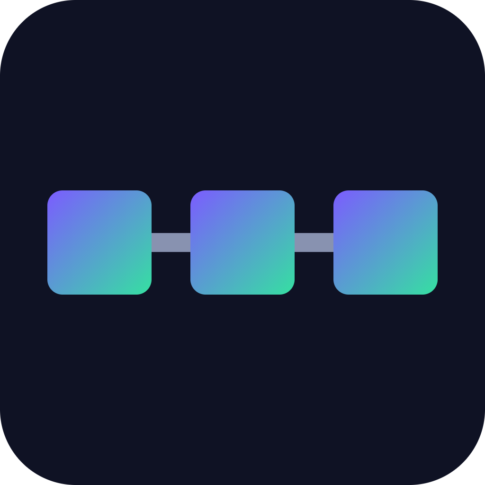

# ChainTris


**Battle-royale Tetris where entry fees form a SOL prize pool for the last block standing.**

## Overview
ChainTris is a 99-player style Tetris battle royale where players pay a small SOL entry fee that gets pooled into a smart contract prize. Attack lines are sent between players in real time, and the final standings trigger an automatic on-chain payout to the top finishers. A commit-reveal scheme locks in each match's RNG seed so results are verifiable and cheat-resistant.

## Problem
Existing Tetris battle royale games have no real stakes or verifiable fairness, so competitive players lose interest quickly. There is no way to prove that the piece sequences are truly random, and there is no financial incentive tying players to the outcome.

## Solution
ChainTris combines real-time multiplayer Tetris with a Solana escrow contract. Entry fees are pooled on-chain, match RNG is committed and later revealed for verifiability, and prizes are distributed automatically to top finishers based on the verified match outcome.

## Features (MVP)
- Real-time multiplayer Tetris with attack-line mechanics for up to 8 players (MVP scale)
- SOL entry fee escrow via an Anchor program with automatic prize distribution
- Commit-reveal RNG seed to guarantee fair, verifiable piece sequences
- Wallet-based login and match history dashboard
- Simple spectator mode for ongoing matches

## Tech Stack
Anchor, Rust, Colyseus, React, Phaser.js, Solana Wallet Adapter, WebSockets

## How It Works

```
[Player Wallet] --pay entry fee--> [Anchor Escrow Program on Solana]
        |                                   |
        v                                   v
[React + Wallet Adapter UI]        [Commit-Reveal RNG Seed]
        |                                   |
        v                                   v
[Colyseus Match Server] <--WebSockets--> [Phaser.js Game Client]
        |
        v
[Final Standings] --submit result--> [Anchor Program pays out top finishers]
```

Players connect a wallet and pay a SOL entry fee into an Anchor escrow program. A commit-reveal RNG seed is locked in before the match so the piece sequence can later be verified as fair. The Colyseus server manages real-time gameplay and attack-line exchange between players over WebSockets, rendered with Phaser.js on a React frontend. When the match ends, final standings are submitted and the Anchor program automatically distributes the prize pool to the top finishers.

## Roadmap
- Scale matchmaking to 50-99 concurrent players
- Add spectator betting on ongoing matches
- Introduce seasonal ranked ladders with NFT trophies

## Pitch
See our [pitch deck](docs/pitch.pdf) and [pitch script](docs/pitch-script.md) for more details.

## Team
- [Name] - Role - [GitHub/Contact]
- [Name] - Role - [GitHub/Contact]
- [Name] - Role - [GitHub/Contact]

---

🎬 Pitch video: [docs/pitch-video.mp4](docs/pitch-video.mp4)
